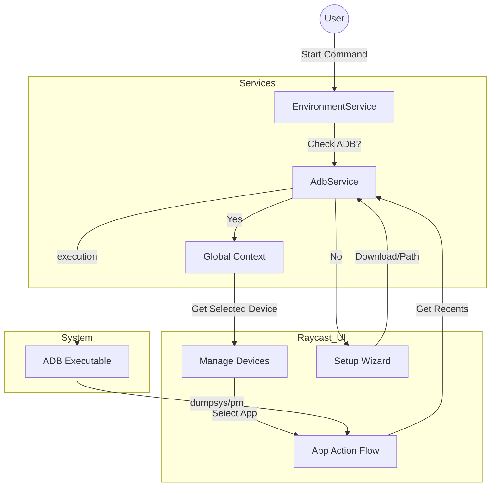

# ADB Pro - Master Plan & Product Requirement Document

> **Vision**: To be the "Superhuman of ADB tools" — fast, keyboard-centric, and aesthetically pleasing. A tool that solves 90% of daily Android development struggles without ever touching the terminal.

---

## 1. UX Philosophy & Onboarding

### 🛠 Onboarding: The "Zero-Config" Promise
We assume the user might not have `adb` in their path. The plugin must be self-reliant.
*   **Startup Check**: Every command initializes an `AdbEnvironment` check.
*   **Scenario A: ADB Found**: Proceed normally.
*   **Scenario B: ADB Missing**:
    *   **Show Setup Screen**: "ADB Not Found".
    *   **Option 1**: "I have Android Studio" -> Auto-search common paths (`~/Library/Android/sdk/...`).
    *   **Option 2**: "I use Homebrew" -> `brew install android-platform-tools`.
    *   **Option 3**: Manual Path Entry.
*   **Validation**: Run `adb --version` and show a green success toast.

### 🧠 Context-Aware Workflows
Users shouldn't select the device every time if they only have one, or if they just used one.
*   **Global State**: `selectedDeviceId` is persisted.
*   **Smart Sequence**:
    1.  **Command Triggered** (e.g., "Revoke Permissions").
    2.  **Context Check**: Is `selectedDeviceId` valid and connected?
        *   **Yes**: Skip to step 3.
        *   **No**: Show **Device Picker**.
    3.  **App Selection** (if needed):
        *   **Section 1: Recent Apps**: Top 3 running apps (via `dumpsys activity`).
        *   **Section 2: Installed Apps**: Alphabetical list of user apps.
    4.  **Action Execution**: Perform task.

---

## 2. Raycast Commands Reference (Top-Level)

Each action below is a standalone command in Raycast for maximum speed and accessibility. No deep nesting; just search and execute.

### 🛡 Core & Setup
#### Check ADB Status
*   **Name**: `check-adb`
*   **Title**: Check ADB Status
*   **Subtitle**: System Health
*   **Description**: Verify if ADB is installed and properly configured in your system path.
*   **Mode**: `view` (Setup Wizard if failed)

#### Manage Devices
*   **Name**: `manage-devices`
*   **Title**: Manage Devices
*   **Subtitle**: ADB Dashboard
*   **Description**: The central hub to view all connected devices and their statuses.
*   **Mode**: `view`

---

### 📦 App Management (Standalone)
#### Force Stop App
*   **Name**: `force-stop`
*   **Title**: Force Stop App
*   **Subtitle**: Kill Process
*   **Description**: Immediately stop a running application on the selected device.
*   **Mode**: `view` (Selection Flow: Device -> App)

#### Clear App Data
*   **Name**: `clear-data`
*   **Title**: Clear App Data
*   **Subtitle**: Reset App
*   **Description**: Wipe all data and cache for a specific application.
*   **Mode**: `view` (Selection Flow: Device -> App)

#### Uninstall App
*   **Name**: `uninstall-app`
*   **Title**: Uninstall App
*   **Subtitle**: Remove
*   **Description**: Remove an application from the selected device.
*   **Mode**: `view` (Selection Flow: Device -> App)

#### Install APK
*   **Name**: `install-apk`
*   **Title**: Install APK
*   **Subtitle**: Deployment
*   **Description**: Select an APK from your computer and install it onto a device.
*   **Mode**: `view` (File Picker -> Device Selection)

#### Manage Permissions
*   **Name**: `manage-permissions`
*   **Title**: Manage Permissions
*   **Subtitle**: Security
*   **Description**: Easily grant or revoke system permissions (Camera, Location, etc.) for any app.
*   **Mode**: `view` (Device -> App -> Permissions)

#### Launch App
*   **Name**: `launch-app`
*   **Title**: Launch App
*   **Subtitle**: Start Activity
*   **Description**: Instantly start the main activity of the selected application.
*   **Mode**: `view` (Selection Flow: Device -> App)

#### Close App
*   **Name**: `close-app`
*   **Title**: Close App
*   **Subtitle**: Kill Process
*   **Description**: Force-stop the selected application's process.
*   **Mode**: `view` (Selection Flow: Device -> App)

#### Open App Settings
*   **Name**: `open-app-settings`
*   **Title**: Open App Settings
*   **Subtitle**: System Settings
*   **Description**: Open the Android system settings page for the specific app (Storage, Cache, Permissions).
*   **Mode**: `view` (Device -> App selection)

---

### 🔥 Pro Developer Tools
#### Logcat Viewer
*   **Name**: `view-logcat`
*   **Title**: View Logcat
*   **Subtitle**: Debug Logs
*   **Description**: Stream real-time logs from your device directly into Raycast. Supports filtering by Tag or Level.
*   **Mode**: `view` (Text View with streaming)

#### Firebase/GA Debug Mode
*   **Name**: `firebase-debug`
*   **Title**: Firebase Debug Mode
*   **Subtitle**: Analytics Testing
*   **Description**: Enable or disable Firebase Analytics debug mode (`setprop`) for a specific app package.
*   **Mode**: `view` (Device -> App -> Toggle)

#### Send Clipboard Text
*   **Name**: `send-clipboard`
*   **Title**: Send Clipboard Text
*   **Subtitle**: Input Simulation
*   **Description**: Instantly type your Mac's clipboard content into the focused text field on the device.
*   **Mode**: `no-view` (Instant execution)

#### Set Proxy (Charles/Proxyman)
*   **Name**: `set-proxy`
*   **Title**: Set HTTP Proxy
*   **Subtitle**: Network Debugging
*   **Description**: Configure the device's global HTTP proxy for traffic interception tool.
*   **Mode**: `view` (Form for IP/Port)

---

### ⚡️ System & Network Controls
#### Toggle Dark Mode
*   **Name**: `toggle-dark-mode`
*   **Title**: Toggle Dark Mode
*   **Subtitle**: UI Theme
*   **Description**: Force the system theme to switch between Light and Dark mode.
*   **Mode**: `no-view` (Instant Toggle)

#### Toggle WiFi
*   **Name**: `toggle-wifi`
*   **Title**: Toggle WiFi
*   **Subtitle**: Network
*   **Description**: Enable or disable WiFi connectivity on the target device.
*   **Mode**: `no-view` (Instant Toggle)

#### Toggle Mobile Data
*   **Name**: `toggle-mobile-data`
*   **Title**: Toggle Mobile Data
*   **Subtitle**: Network
*   **Description**: Enable or disable cellular data.
*   **Mode**: `no-view` (Instant Toggle)

#### Toggle Airplane Mode
*   **Name**: `toggle-airplane-mode`
*   **Title**: Toggle Airplane Mode
*   **Subtitle**: Network
*   **Description**: Quickly switch Airplane Mode on or off.
*   **Mode**: `no-view` (Instant Toggle)

#### Toggle Layout Bounds
*   **Name**: `toggle-layout-bounds`
*   **Title**: Toggle Layout Bounds
*   **Subtitle**: Debugging
*   **Description**: Visualize UI boundaries and margins for design debugging.
*   **Mode**: `no-view` (Instant Toggle)

#### Restart ADB Server
*   **Name**: `restart-adb`
*   **Title**: Restart ADB Server
*   **Subtitle**: Troubleshooting
*   **Description**: Kill and restart the ADB server if devices are not reflecting correctly.
*   **Mode**: `no-view` (Silent execution with toast)

---

### 🖼 Multimedia & Tools
#### Take Screenshot
*   **Name**: `take-screenshot`
*   **Title**: Take Screenshot
*   **Subtitle**: Media
*   **Description**: Capture the device screen and save it to your desktop or clipboard.
*   **Mode**: `no-view` (Instant)

#### Record Screen
*   **Name**: `record-screen`
*   **Title**: Record Screen
*   **Subtitle**: Media
*   **Description**: Start or stop a screen recording on the selected device.
*   **Mode**: `no-view` (Toggle start/stop)

#### Open Deep Link
*   **Name**: `open-deep-link`
*   **Title**: Open Deep Link
*   **Subtitle**: Navigation
*   **Description**: Dispatch a custom URI scheme or App Link to a specific device.
*   **Mode**: `view` (Form)

#### Connect via IP
*   **Name**: `wireless-connect`
*   **Title**: Connect via IP
*   **Subtitle**: Wireless Debugging
*   **Description**: Pair and connect to a device over TCP/IP (WiFi).
*   **Mode**: `view` (Form for IP/Port)

---

### 💻 Emulator Management
#### Launch Emulator (AVD)
*   **Name**: `launch-emulator`
*   **Title**: Launch Emulator
*   **Subtitle**: Virtual Devices
*   **Description**: List all installed Android Virtual Devices (AVDs) and boot them without opening Android Studio.
*   **Mode**: `view` (List of AVDs)

#### Kill Emulator
*   **Name**: `kill-emulator`
*   **Title**: Kill Emulator
*   **Subtitle**: Force Close
*   **Description**: Immediately shut down the selected running emulator instance.
*   **Mode**: `no-view` (Instant)

---

### 🔋 Power & Performance
#### Battery Simulator
*   **Name**: `simulate-battery`
*   **Title**: Simulate Battery
*   **Subtitle**: Power Testing
*   **Description**: Change battery level (0-100) and charging state to test low-power app behavior.
*   **Mode**: `view` (Form/Slider)

#### Benchmark Cold Start
*   **Name**: `benchmark-start`
*   **Title**: Benchmark Cold Start
*   **Subtitle**: Performance
*   **Description**: Measure the time (`am start -W`) it takes for an app to reach its first frame.
*   **Mode**: `view` (Selection Flow -> Result Toast)

---

### 🧪 Advanced Testing
#### Change Resolution/DPI
*   **Name**: `set-resolution`
*   **Title**: Change Resolution/DPI
*   **Subtitle**: UI Testing
*   **Description**: Override the device's screen size and density to test layouts on different form factors.
*   **Mode**: `view` (Presets: Pixel 8, Small Tablet, etc.)

#### Simulate Hardware Keys
*   **Name**: `simulate-keys`
*   **Title**: Simulate Hardware Keys
*   **Subtitle**: Navigation
*   **Description**: Trigger hardware buttons like Home, Back, Recents, and Power from your keyboard.
*   **Mode**: `view` (Grid of buttons)

---

## 3. Premium UX Polish

To make this feel like a "Pro" extension, we will implement these subtle but high-impact patterns:

1.  **Optimistic Toggles**: For network toggles (WiFi/Data), the UI should reflect the *new* state immediately while the ADB command executes async.
2.  **Adaptive Detail Views**: When viewing a device, show metadata like Android Version, API Level, and Battery Percentage in a Raycast `Detail` side-pane.
3.  **Smart Keyboard Shortcuts**:
    *   `Cmd + R`: Restart selected app.
    *   `Cmd + Shift + S`: Take screenshot.
    *   `Cmd + B`: Toggle Layout Bounds.
4.  **Error Recovery**: If a command fails because "Device is unauthorized", show a custom UI explaining how to check the "Always allow" prompt on the physical screen.
5.  **Multi-Device Broadcast**: Hold `Cmd` while selecting devices to run a command (like `Clear Data`) on multiple targets simultaneously.

---

## 3. Technical Architecture

### High-Level Components
1.  **Presentation Layer (UI)**: React + Raycast API. Uses `ActionPanel` heavily for nested flows.
2.  **Service Layer (`AdbService`)**:
    *   **`EnvironmentService`**: Handles Path detection and Setup logic.
    *   **`DeviceService`**: Polling and Connection state.
    *   **`AppService`**: Parsing `pm list` and `dumpsys` outputs.
3.  **Infrastructure**: Node `child_process`.

### Visual Architecture

---

## 4. Roadmap & Milestones

### Phase 1: Core Foundation & Onboarding (Weeks 1-2)
*   [x] **Setup Wizard**: Implement `adb` detection and "Path Picker" UI.
*   [x] **Environment Service**: Robust cross-platform check.
*   [x] Basic Device List & USB Connect.
*   [x] **Restart ADB Server**: Troubleshooting command.
*   [x] **Flattened Architecture**: Refactor all actions into standalone Raycast commands.

### Phase 2: The App Manager (Weeks 3-4)
*   [x] **Smart App Selector**: Logic to parse `dumpsys activity` for "Recent Apps".
*   [x] **App Lifecycle**: Launch, Close, Restart, Clear Data logic.
*   [x] **Standalone Command**: `Open App Settings`.
*   [x] **Install/Uninstall**: File picker integration.

### Phase 3: Deep Control & Virtualization (Weeks 5-6)
*   [x] **Permission Editor**: Parsing permission lists and toggling state.
*   [x] **System Toggles**: WiFi/Data/Layout Bounds/Dark Mode.
*   [x] **Instant Input**: `Send Mac Clipboard to Device`.
*   [x] **AVD Manager**: Launch and Kill Android Emulators (Virtual Devices).
*   [x] **Proxy Manager**: Set/Clear HTTP Proxy for Charles/Proxyman.

### Phase 4: Pro Features & Performance (Weeks 7-8)
*   [x] **Logcat Streamer**: Real-time log viewing in Raycast.
*   [x] **Performance Suite**: Benchmark Cold Start and Battery Simulation.
*   [x] **UI Testing Suite**: Override Resolution/DPI and hardware key simulation.
*   [x] **Analytics Testing**: Toggle `Firebase Debug Mode`.
*   [x] **Wireless Wizard**: Automate the USB -> TCP/IP switch.
*   [x] **Scrcpy integration**: Screen mirroring launcher.
